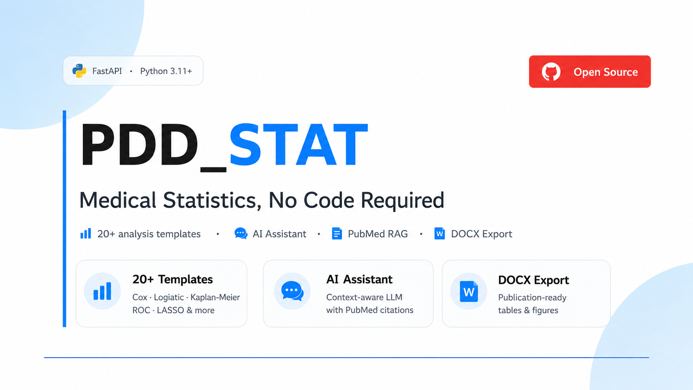

<p align="center">
  
</p>

<h1 align="center">PDD_STAT · Medical Statistics, No Code Required</h1>

<p align="center">
  <a href="https://github.com/dziameshkapavel/PDD_stat/actions"></a>
  
  
</p>

<p align="center">
  <strong>20+ medical analysis templates</strong> · <strong>AI Assistant</strong> · <strong>PubMed RAG</strong> · <strong>DOCX Export</strong>
</p>

---

## Quick Start

```bash
git clone https://github.com/dziameshkapavel/PDD_stat.git
cd PDD_stat

# macOS — double-click or:
./setup_mac.command && ./start_backend.command

# Windows — double-click or:
# setup.bat  (one-time install)
# start.bat  (starts server)
```

Open http://localhost:8000.

---

## Table of Contents

- [Prerequisites](#prerequisites)
- [Installation — macOS](#installation--macos)
- [Installation — Windows](#installation--windows)
- [Docker (alternative)](#docker-alternative)
- [Project Structure](#project-structure)
- [Tests](#tests)

---

## Prerequisites

| What | Why | Check |
|------|-----|-------|
| **Git** | Clone the repo | `git --version` |
| **Python 3.11+** | Run the app | `python3 --version` |
| **Docker** (optional) | Run via container | `docker --version` |

### Git

```bash
git --version
```

- **macOS:** `xcode-select --install` or https://git-scm.com/download/mac
- **Windows:** https://git-scm.com/download/win (defaults are fine)

### Python 3.11+

```bash
python3 --version
```

Need **3.11 or newer**.

- **macOS (Intel + Apple Silicon):**
  ```bash
  /bin/bash -c "$(curl -fsSL https://raw.githubusercontent.com/Homebrew/install/HEAD/install.sh)"
  brew install python@3.12
  ```
  Or download from https://www.python.org/downloads/

- **Windows:**
  Download from https://www.python.org/downloads/
  **Important:** check **"Add Python to PATH"** during install.

- **Linux:**
  ```bash
  sudo apt update && sudo apt install python3 python3-pip python3-venv
  ```

---

## Installation — macOS

### One-time setup

Double-click **`setup_mac.command`** (or run from terminal):

```bash
./setup_mac.command
```

This will:
1. Find Python 3.12 → 3.11 → 3.10 → 3 (or install via Homebrew)
2. Create `.venv` at the project root
3. Install all dependencies (`pip install -r app/backend/requirements.txt`)

**Result:** all 70+ packages installed in `.venv/`.

### Start the app

Double-click **`start_backend.command`** — it will:
1. Auto-run setup if `.venv` is missing
2. Launch the server in background
3. Open http://localhost:8000 in your browser

To stop: `Ctrl+C` in terminal.

### Update

```bash
./update_mac.command
```

Pulls latest code and reinstalls dependencies.

---

## Installation — Windows

### One-time setup

Double-click **`setup.bat`** (or run from terminal):

```batch
setup.bat
```

This will:
1. Check for 64-bit Python 3.11+
2. Try `py -3.12` → `py -3.11` → `python` (with version check)
3. Create `.venv` at the project root
4. Install all dependencies

### Start the app

Double-click **`start.bat`** — it will:
1. Auto-run setup if `.venv` is missing
2. Launch the server
3. Open http://localhost:8000 in your browser

### Update

```batch
update.bat
```

---

## Docker (alternative)

Docker is **optional**. Use it if:
- You already have Docker Desktop installed
- You want a reproducible environment without host Python
- You're deploying to a server

**Docker is not required** for the "download → double-click → use" flow.

```bash
docker compose up -d --build
```

Then open http://localhost:8000.

What it does:
1. Builds a Python 3.11-slim image (first build: 3–5 min)
2. Installs all dependencies
3. Starts uvicorn with 2 workers
4. Mounts `./projects/` and `./data/` as volumes (data persists across restarts)
5. Includes healthcheck and auto-restart

Stop:
```bash
docker compose down
```

With API key:
```bash
PDD_STAT_API_KEY=my-secret-key docker compose up -d
```

---

## Project Structure

```
PDD_stat/
├── app/
│   ├── backend/
│   │   ├── app/
│   │   │   ├── main.py              # FastAPI entrypoint
│   │   │   ├── api/                 # API routers (projects, analysis, ai)
│   │   │   ├── core/                # Business logic
│   │   │   │   ├── executor.py      # Python code executor
│   │   │   │   ├── modeling_orchestrator.py  # Template engine (Jinja2)
│   │   │   │   ├── data_loader.py   # File upload & parsing
│   │   │   │   ├── rule_engine.py   # Data cleaning rules
│   │   │   │   ├── pubmed_api.py    # PubMed E-utilities wrapper
│   │   │   │   ├── auth.py          # Optional API key auth
│   │   │   │   └── ai/              # AI chat module
│   │   │   │       ├── ai_clients.py      # Ollama / Groq providers
│   │   │   │       ├── context_builder.py # Dataset + PubMed context
│   │   │   │       ├── response_validator.py  # Zahl-check against metrics
│   │   │   │       ├── prompt_manager.py     # YAML prompt loader
│   │   │   │       └── tools.py             # Template metadata
│   │   │   ├── templates/           # 20+ analysis templates (*.py.jinja)
│   │   │   └── prompts/             # AI system prompts (YAML)
│   │   ├── tests/                   # 69 tests (pytest)
│   │   └── requirements.txt
│   └── frontend/                    # Vanilla HTML/JS/CSS (no build)
├── projects/                        # User data (gitignored)
├── Dockerfile
├── docker-compose.yml
├── setup_mac.command                # macOS one-time install
├── start_backend.command            # macOS launcher
├── update_mac.command               # macOS updater
├── setup.bat                        # Windows one-time install
├── start.bat                        # Windows launcher
├── update.bat                       # Windows updater
└── README.md
```

---

## Tests

```bash
cd app/backend
python3 -m pytest tests/ -v
```

69 tests: 38 unit (response validator) + 20 API (FastAPI TestClient) + 11 systematic hallucination tests.
